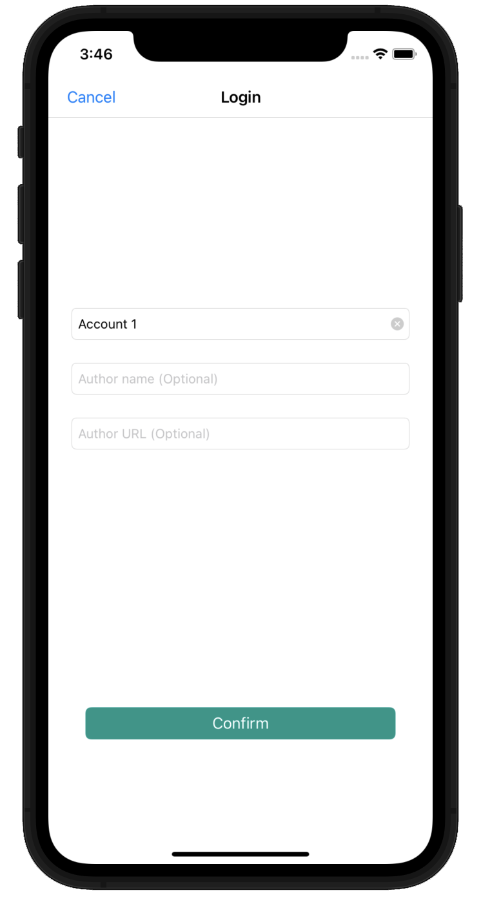
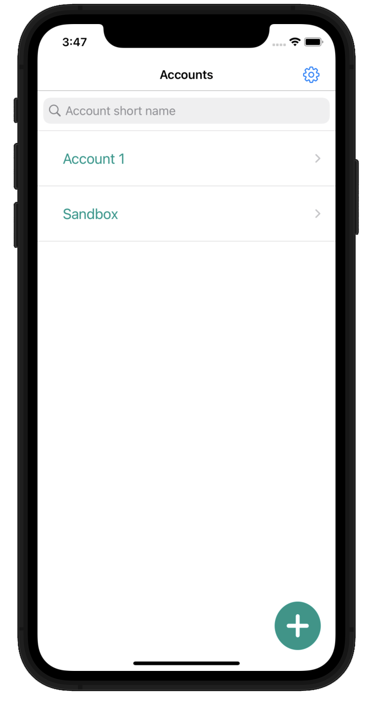
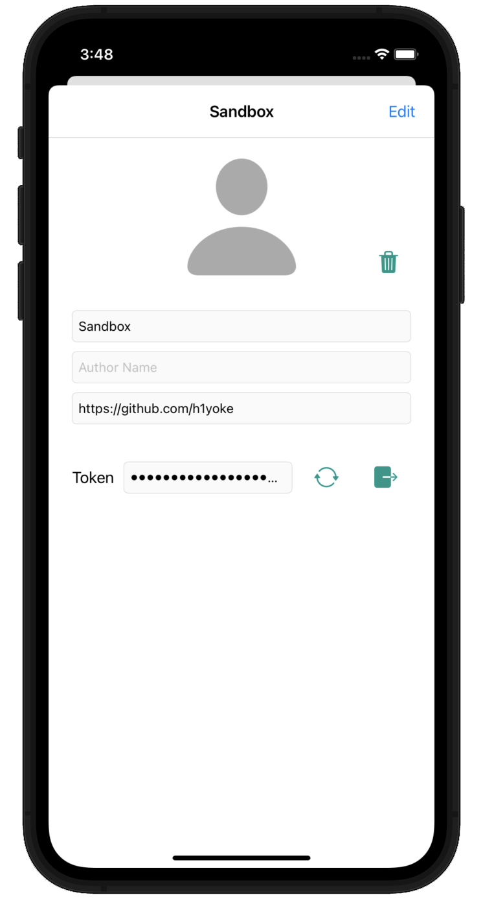
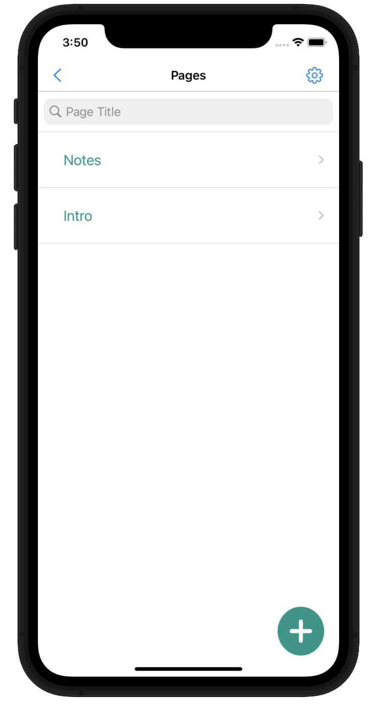
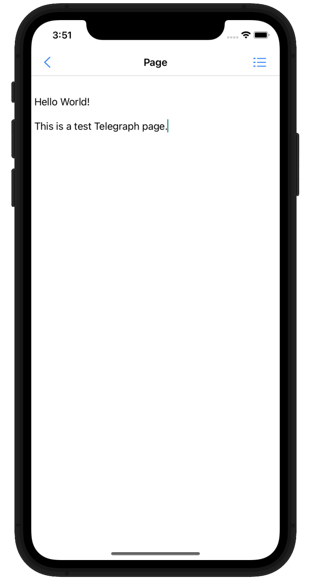

# Telegra.ph third-party iOS application

A tool to create, edit and share Telegra.ph pages on iOS. Works via [Telegraph API](https://telegra.ph/api).

<a href="https://www.flaticon.com/free-icons/telegraph" title="telegraph icons">Telegraph icons created by Smashicons - Flaticon</a>

## Differeneces from [Telegram bot](https://t.me/telegraph)

- Unlimited accounts
- Access token is encrypted, but can be copied or revoked

## Screenshots

## Project dependencies

- [SwiftLint](https://github.com/realm/SwiftLint)
- Telegraph API (requiers internet connection to load and submit pages)
