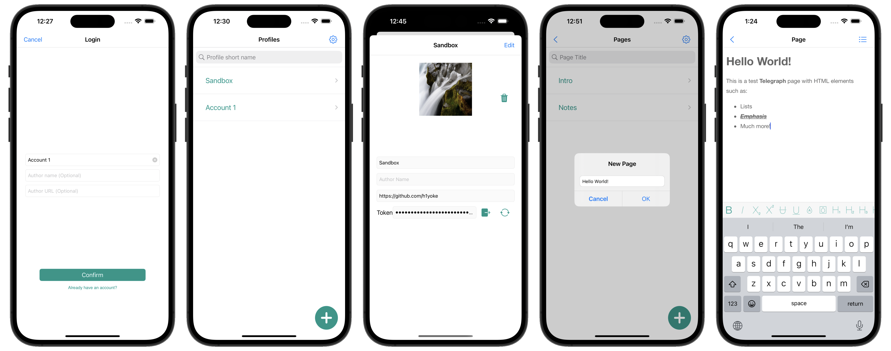

# Telegra.ph third-party iOS application

A tool to create, edit and share Telegra.ph pages on iOS. Works via [Telegraph API](https://telegra.ph/api).

<a href="https://www.flaticon.com/free-icons/telegraph" title="telegraph icons">Telegraph icons created by Smashicons - Flaticon</a>

## Differeneces from [Telegram bot](https://t.me/telegraph)

- Unlimited accounts
- Access token is encrypted, but can be copied or revoked

## Screenshots

## Project dependencies

- [SwiftLint](https://github.com/realm/SwiftLint)
- RichTextEditor (now is archived and no longer supported)
- Telegraph API (requiers internet connection to load and submit pages)

## Code details

- MVC architecture
- KeyChain
- Core Data
- DispatchQueue
- Single-tone

## App structure

Telegraph app stores *Profiles* - units that allow to create and edit *Pages*.

### Profile

*Profile* is a main application unit that is composed by Telegraph API data and local data such as profile pictures. For security reasons, each app profile is assigned with UUID and split on encrypted and non-encrypted parts. More details in ERD below:

### Page

*Page* is a Telegraph API unit that is stored in Telegraph database. Can be accessed only with internet connection and corresponding profile key. 
